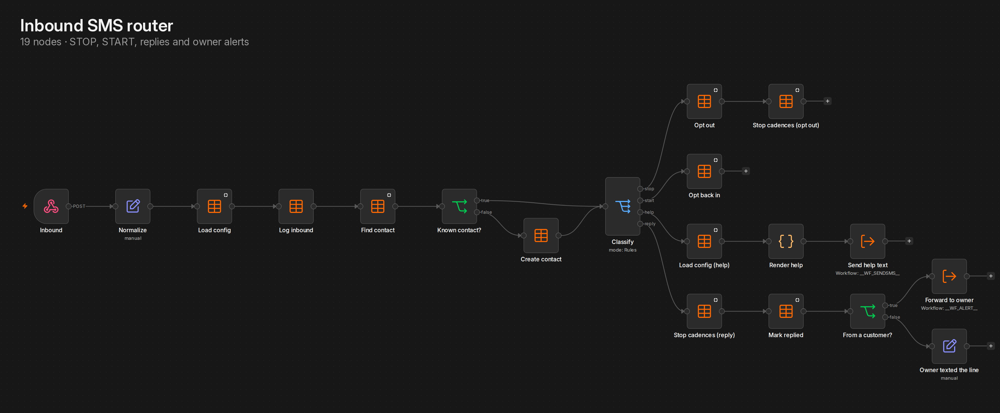
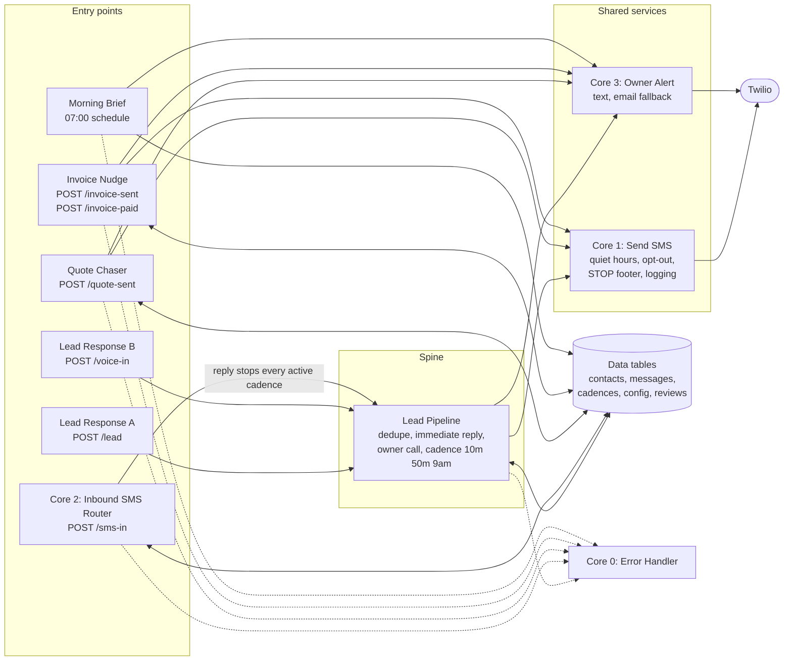

# Lead Response

Fifteen n8n workflows that make sure a small business never loses a lead to a missed call, and then keeps following up after it.

This is not a demo. It was extracted from a live production install running on n8n Cloud against a real Twilio number, tested on real handsets, and it found a real bug in the process. Credentials are stripped and identifiers are replaced with placeholders.

## What it does

A lead arrives, either from a website form or from someone calling and getting no answer.

Within about a second the customer gets a text from the business number. At the same time the owner gets a text saying who it is, their number and what they said. Then the owner's phone rings, a short recorded line says there is a new lead, and pressing 1 connects them straight to the customer with the business number showing as caller ID rather than the owner's personal cell.

If the owner does not pick up, nothing is lost. The system texts the customer again at ten minutes, again fifty minutes after that, and once more at nine the next business morning. Then it stops and tells the owner how it went.

The moment the customer replies, the whole sequence ends. No more automatic texts. The owner gets the message forwarded and is in a normal conversation with a real person. Getting out of the way is the thing most automated follow-up gets wrong.

STOP, START and HELP are handled. Quiet hours are enforced in the business's own time zone, with one deliberate exception: someone who just made contact thirty seconds ago gets the immediate reply regardless of the hour, because that is a reply, not marketing.

## How it fits together

Every outbound text in the system goes through Core 1, so quiet hours and
opt-out are enforced in one place rather than fifteen. Full detail, including
what happens when each piece fails, is in [docs/ARCHITECTURE.md](docs/ARCHITECTURE.md).

## The eight workflows

Import in this order. Each one refers to the ones before it.

| # | Workflow | Nodes | What it is |
| --- | --- | --- | --- |
| 1 | Setup: tables and settings | 11 | Creates the five data tables and writes the config row |
| 2 | Core 0: Error Handler | 5 | Every other workflow points its error handler here |
| 3 | Core 1: Send SMS | 16 | The single send path. Quiet hours, opt-out check, STOP footer, delivery logging |
| 4 | Core 3: Owner Alert | 9 | Alerts the owner. Falls back to email if the text is refused |
| 5 | Lead Pipeline | 32 | The spine. Dedupe, immediate reply, owner call, the follow-up cadence |
| 6 | Core 2: Inbound SMS Router | 19 | Inbound texts. STOP, START, HELP, reply detection, cadence stop |
| 7 | Lead Response A: Website form | 3 | Webhook entry point for a form |
| 8 | Lead Response B: Phone line | 13 | Voice entry point. Missed call detection and the press-1 bridge |

108 nodes total. Five data tables: contacts, messages, cadences, config, reviews.
The first four are used by the eight below. `reviews` is created here so that Morning Brief works on a clean install.

## The three add ons

These sit on top of the eight. Each one is self contained, reuses Core 1, Core 3 and the `cadences` table, and needs no change to anything above it. A reply to any of them stops it, because the inbound router closes every active cadence for a number without caring which workflow opened it.

| # | Workflow | Nodes | What it is |
| --- | --- | --- | --- |
| 9 | Quote Chaser | 28 | A quote goes out and nobody answers. Three nudges, then it gives up and tells the owner |
| 10 | Invoice Nudge | 38 | Same shape for money owed, keyed off the due date. A second entry point marks it paid, stops the reminders and sends a receipt |
| 11 | Morning Brief | 9 | One text at 7am. What came in, what is still waiting on a reply, what follow ups are running, what the review scores did |

Morning Brief reads the `reviews` table, which setup creates and which the review workflow in the paid version writes to. On an install without it the review lines are simply absent from the brief.

They were generated rather than extracted from a live install, then run against the real system on 2026-09-20. Quote Chaser passed 9 of 9, Invoice Nudge 18 of 18, Morning Brief 8 of 9 with one cosmetic partial. Two real bugs turned up and both are written up in [docs/TEST-RESULTS.md](docs/TEST-RESULTS.md). Every setting they read has a default, so they run on an existing install without touching the config table.

## The three entry forms

The add ons are webhooks, which is right for a website or a CRM to call but wrong for a person standing in a driveway with a phone. These three are hosted n8n forms that post to those same webhooks, so a quote chase or an invoice reminder can be started from a phone with no app, no login and no curl.

| # | Workflow | Nodes | What it is |
| --- | --- | --- | --- |
| 12 | Entry: Quote sent (form) | 2 | Phone, name, amount, job, quote link. Starts Quote Chaser |
| 13 | Entry: Invoice sent (form) | 2 | Adds invoice number, link and due date. Starts Invoice Nudge |
| 14 | Entry: Invoice paid (form) | 2 | Stops the reminders and sends the receipt |

Each form's URL is public to anyone who has it, so treat it like a shared password. n8n gives the form a random address, and the form trigger also supports basic auth if you want a login on it.

The quote form was run end to end against the live system on 2026-09-20: form submitted, Quote Chaser started, owner alert delivered, cadence left waiting on the first nudge.

## Appointment reminders

| # | Workflow | Nodes | What it is |
| --- | --- | --- | --- |
| 15 | Appointment Reminder | 24 | A booking goes in, the customer gets a reminder the day before and again shortly before, and the owner hears about the booking straight away |

Post a booking to `/appointment-booked` with a phone, a name and a `when`, either ISO or `YYYY-MM-DD HH:mm` in the business time zone. Anything it cannot parse is rejected rather than guessed at, because a reminder at the wrong hour is worse than no reminder.

Two things in here are worth reading before you copy the pattern.

**Quiet hours are resolved before the send, not by the send.** Every other outbound text in this pack defers to the morning if it lands inside quiet hours, which is correct for a nudge and wrong for a reminder: a reminder deferred to 8am can arrive after the appointment it was reminding about. So this workflow moves a reminder that falls inside quiet hours to the moment quiet hours end, and drops it if that is not before the appointment. It then tells the send path not to defer it again.

**A reminder that cannot be useful is not sent.** Book something three hours out and the day before reminder has nowhere to go, so it does not fire. Two reminders that would land within five minutes of each other are treated as one.

A reply stops the reminders, because the inbound router closes any active cadence for that number. For a reminder that is the right behaviour: the customer is now talking to a person, and a person who just said "see you then" does not need another text.

## Standalone templates

The workflows above are a system and cannot be imported one at a time. [templates/](templates/) holds single workflows that stand alone, written for n8n's public template library. The first is an SMS quote chaser that asks Twilio directly whether the customer has replied, so it needs no database at all. The second texts the owner a 7am brief built from the Twilio message log: who texted, what went out, what failed and who is still waiting. The third sends a booking confirmation and two appointment reminders, with quiet hours worked out the moment the booking arrives. The fourth tells the owner the moment a customer texts STOP, START or HELP, and can pass opt-outs to a CRM. The fifth texts each customer your Google review link after the job, once in 90 days and never in quiet hours, checking the Twilio log instead of a database.

## Install

Read [docs/SETUP.md](docs/SETUP.md). It is the runbook from the first real install, written from what happened rather than from a plan, and it budgets an hour, most of it waiting on signups.

You need an n8n instance with Data Tables, a Twilio account, and a number that is already A2P registered. A brand new number cannot text until A2P clears, which takes days. That is the single most common thing that delays a launch, so check it first.

`workflows/lead-response-workflows.json` is the importable bundle of all fifteen. It is generated from `workflows/individual/` by `scripts/build_bundle.py` and never edited by hand, so the two can never drift apart.

After import, four cross references need repointing. They appear in the bundle as `__WF_ERROR__`, `__WF_SENDSMS__`, `__WF_ALERT__` and `__WF_PIPELINE__`.

Four values need filling in: `__OWNER_CELL__`, `__BUSINESS_NUMBER__`, `__OWNER_EMAIL__`, `__N8N_HOST__`.

## Does it work

[docs/TEST-RESULTS.md](docs/TEST-RESULTS.md) has the log for all eleven of the workflows that send. The core eight: 11 of 13 passed on the live system with timestamps, and the two that are not fully verified are written up rather than quietly left out, including exactly which last inch of the press-1 connect is unproven and why. The three add ons: 35 of 36 checks passed, with the one partial and two fixed bugs described in full.

The bug that was found is written up too. The owner alert was being sent from the business number, so an owner who had ever texted STOP to their own line would have silently stopped receiving lead alerts. It failed closed and quiet, which is the worst way for this particular system to fail. Fixed in Core 3 and re-tested.

## Docs

- [docs/ARCHITECTURE.md](docs/ARCHITECTURE.md), how the pieces fit, the contracts between them and what happens when each one fails
- [docs/HOW-IT-WORKS.md](docs/HOW-IT-WORKS.md), plain English, written for a business owner rather than a developer
- [docs/SETUP.md](docs/SETUP.md), the install runbook plus a single page to leave with the owner
- [docs/TEST-RESULTS.md](docs/TEST-RESULTS.md), what was tested, what passed, what did not, and the bug
- [docs/TEST-PLAN.md](docs/TEST-PLAN.md), the script that was run at the keyboard for the three add ons

## Limits

This is built for one business per instance. n8n's license does not allow running a customer's workflows on your own instance, so each business needs their own.

HELP is answered by Twilio itself on any number inside a messaging service, so the workflow never sees it. Set the wording in the messaging service opt-out settings.

The press-1 bridge is proven up to the point where two live parties hear each other. Run it once with a second phone before you demo it.

## License

MIT. Use it, sell it, change it.

Built by [Mike Matthews](https://github.com/mikematthewsai).
