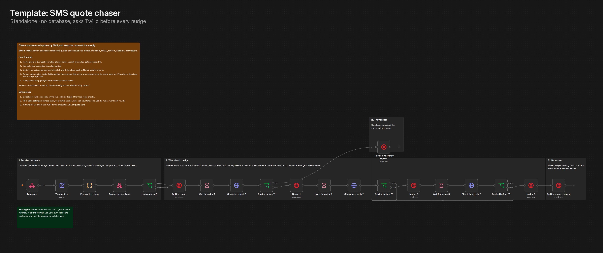
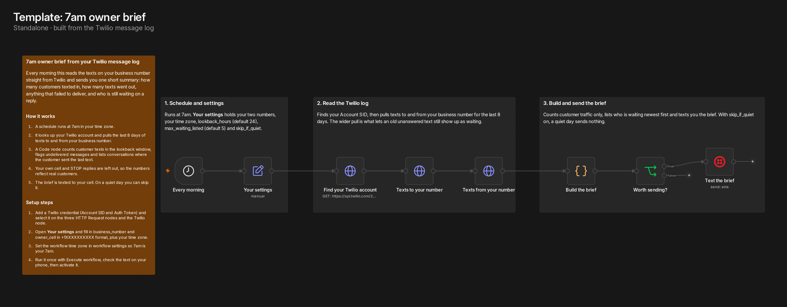
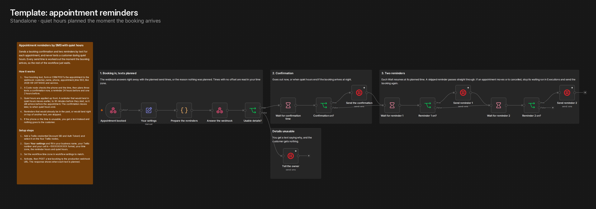
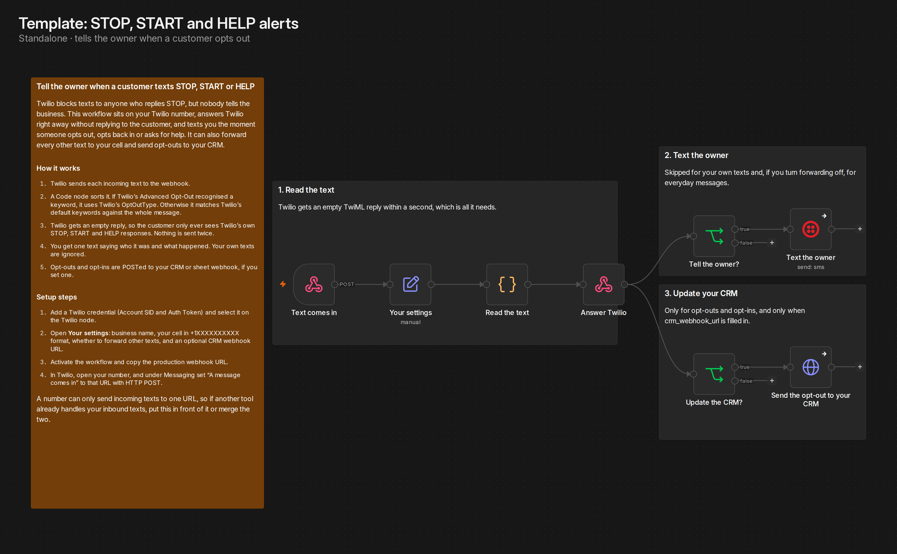
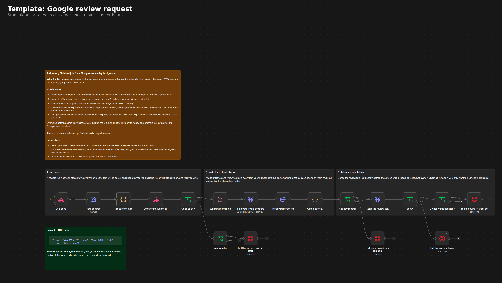

# Standalone templates

The workflows in `workflows/` are a system: they share one send path, one owner alert and a set of data tables, which is what makes them reliable together and also why none of them can be imported on its own.

These are single workflows that stand alone. Each one needs nothing but its own credentials, so they can go in n8n's public template library and be imported in one step.

| Template | What it does | Tested |
| --- | --- | --- |
| [quote-chaser-sms-twilio.json](quote-chaser-sms-twilio.json) | Chases an unanswered quote with up to three SMS nudges and stops the moment the customer replies. No database: before each nudge it asks Twilio whether the customer has texted the business number since the quote went out | 2026-09-20, live, three runs below |
| [owner-brief-sms-twilio.json](owner-brief-sms-twilio.json) | Texts the owner a short summary every morning at 7: customer texts in, texts out, anything undelivered, and who is still waiting on a reply, newest first. No database: it reads the Twilio message log directly | 2026-09-20, live, three runs below |
| [appointment-reminders-sms-quiet-hours.json](appointment-reminders-sms-quiet-hours.json) | Sends a booking confirmation and reminders 24 hours and 2 hours before each appointment, and never texts during quiet hours. Every send time, quiet hours included, is planned the moment the booking arrives, so the waits never have to re-check anything | 2026-09-21, live, four runs plus eleven scheduling cases below |
| [sms-keywords-stop-start-help.json](sms-keywords-stop-start-help.json) | Sits on the Twilio number's incoming-text webhook. Answers Twilio with an empty reply so the customer only sees Twilio's own opt-out responses, then texts the owner when someone texts STOP, START or HELP, forwards everyday texts if wanted, and POSTs opt-outs and opt-ins to a CRM webhook | 2026-09-21, six simulated inbound texts and twelve sorting cases below |
| [google-review-request-sms.json](google-review-request-sms.json) | Texts each customer your Google review link a set time after the job is done (two hours by default), never in quiet hours and never twice inside 90 days. No database: before sending it reads the Twilio message log for an earlier text to that customer carrying your link, and ignores failed sends. Everyone gets the same link, so there is no review gating. The owner hears when an ask goes out, is skipped or fails, with Twilio's own reason | 2026-09-21, live, ten runs plus twenty two harness cases below |
| [website-and-line-watchdog-sms.json](website-and-line-watchdog-sms.json) | Watches the things that quietly stop leads. Every 5 minutes it checks that your websites load (and still show a piece of text you choose), that your Twilio balance is above a floor, that your number still sends calls and texts where it did, and that carriers are not blocking your texts. The owner gets one text when something breaks, a reminder every 4 hours while it stays broken, and one when it recovers. Quiet hours hold everything except routing changes for a morning check-in. No database: it remembers what it already said in the workflow's own static data | 2026-09-22, live, ten runs plus 63 automated checks below |
| [renewal-reminders-sms.json](renewal-reminders-sms.json) | Texts the owner before the things that keep a service business legal to work run out: licenses, insurance, registrations, bonds. The list lives in the workflow, one line per item. Every morning at 8 it texts anything 60, 30, 14, 7, 3 or 1 days out, due today or overdue, with a Done link on each line: a yearly item rolls to next year, a one-time item stops, and the page the link opens has an Undo. No database: rolled dates and one-time link codes live in the workflow's own static data | 2026-09-22, live, eight runs plus 61 automated checks below |

## What they look like

## Quote chaser, test runs on 2026-09-20

Run against a real Twilio number with the waits set to 0.002 days (about three minutes), then set back to the defaults of 2, 3 and 4 days before export.

| Run | Setup | Result |
| --- | --- | --- |
| A | Customer never replies | Passed. Start alert to the owner, three nudges about three minutes apart, then the closing alert. All three reply checks ran against the Twilio API without error |
| B | Customer replies after nudge 1 | Passed. The second reply check found the inbound text, the owner got "replied ... chase stopped", and nudge 2 never sent |
| C | Phone number is `123` | Passed. The webhook answered `{"ok":true}` and nothing was sent |

The exported file was checked against the tested workflow node by node: every node's parameters and the connections hash identically, ignoring generated ids and credential references.

What is not covered: both parties were the same handset, the default multi day waits were not run at full length, and the 10am landing time was not observed live because the test waits were under a day.

## Owner brief, test runs on 2026-09-20

Run against the same Twilio number, triggered by hand instead of waiting for 7am.

| Run | Setup | Result |
| --- | --- | --- |
| A | First draft, 24 hour lookback | Found a bug. The only texts that day were between the owner's cell and the business number, and the brief said "5 texts in from 0 numbers. 42 sent." The owner's own texts were counted as traffic but not as a person |
| B | Owner texts excluded from the counts, 24 hour lookback | Passed, but it listed two waiting customers with no line about traffic. Quiet was still judged on all texts rather than customer texts. Fixed so quiet means no customer texts either way |
| C | Same fix, 24 hour lookback | Passed. "Quiet, nothing came in or went out. Still waiting on you:" followed by the two customers whose last text had no reply |
| D | Lookback set to 168 hours to pull in real customer traffic | Passed. "2 texts in from 2 numbers. 1 sent. Waiting on you, newest first:" with day and time on each |

After testing, the lookback went back to 24 hours and both phone numbers went back to placeholders. The exported file hashes identically to the workflow in n8n, apart from credential references, which are removed.

What is not covered: the 7am schedule itself was not observed firing, a day with undelivered texts did not come up, and the list was never long enough to show the "plus N more" ending.

## Appointment reminders, test runs on 2026-09-21

Live runs against the same Twilio number, with the reminder hours shrunk to minutes so each run finished in under 25 minutes.

| Run | Setup | Result |
| --- | --- | --- |
| A | Appointment 16 minutes out, reminders at 12 and 6 minutes before | Passed. Confirmation sent at once. Reminder 1 was correctly skipped because it would have landed within 5 minutes of booking. Reminder 2 sent on time and the run ended |
| B | Appointment 20 minutes out, reminders at 12 and 6 minutes before | Passed. Confirmation, reminder 1 and reminder 2 all sent at their planned times |
| C | Phone number is `123` | Passed. The webhook answered with the reason, the owner got a text saying why, and nothing went to the customer |
| D | Booked at 11:30 PM inside a live quiet window of 11:00 to 11:45 PM, appointment at 11:58 PM | Passed. The confirmation waited and went out at 11:45:00, the moment quiet hours ended. Reminder 1 fell inside quiet hours, moved earlier, landed in the past and was skipped. Reminder 2 sent at 11:52 |

The planning code also went through eleven scheduling cases in a local harness with the clock frozen, using the real defaults (24 and 2 hours, quiet 8 PM to 8 AM):

| Booked | Appointment | Planned |
| --- | --- | --- |
| Mon 10:00 | Thu 14:00 | Confirmation Mon 10:00, reminders Wed 14:00 and Thu 12:00 |
| Mon 10:00 | Tue 09:00 | Confirmation now. The 24 hour reminder is already past, so it is skipped. The 2 hour reminder falls at 7 AM, inside quiet hours, so it moves to Mon 19:30 |
| Mon 10:00 | Thu 08:30 | Reminders Wed 08:30 and, moved out of quiet hours, Wed 19:30 |
| Mon 10:00 | Thu 07:00 | Both reminders fall inside quiet hours and move to 19:30 the evening before each |
| Mon 23:00 | Tue 09:00 | Confirmation waits until 8:00 AM. Both reminders would be past or inside quiet hours, so only the confirmation goes |
| Mon 23:00 | Tue 07:30 | Nothing is sent: the confirmation would arrive after quiet hours end, which is after the appointment |
| Mon 21:00 | Wed 21:30 | Confirmation Tue 08:00, reminders Tue 19:30 and Wed 19:30 |
| Mon 10:00 | Yesterday | Refused: the appointment time has already passed |
| Mon 10:00 | "next tuesday" | Refused: not an ISO date and time |
| Mon 10:00 | Phone written as 1 (404) 555-0123 | Accepted as +14045550123 |
| Mon 10:00 | Thu 15:00, daytime quiet window 1 to 2 PM | 2 hour reminder moves from 13:00 to 12:30 |

After testing, every setting went back to its default and the business details to placeholders. The exported file hashes identically to the workflow in n8n, apart from credential references, which are removed.

What is not covered: the full 24 hour wait was not run end to end, a number that has texted STOP was not tried (the Twilio nodes are set to carry on if a send fails), and daylight saving changes between booking and appointment were not tested live. A booking that lands too late for any text to fit before the appointment sends nothing and does not alert the owner.

## STOP, START and HELP handler, test runs on 2026-09-21

The workflow was activated and sent the same form-encoded POST that Twilio sends for an incoming text. The owner alerts went out as real texts through Twilio, and the CRM step posted to a public echo service standing in for a CRM. The customer number was a fictional 555 number.

| Run | Incoming text | Result |
| --- | --- | --- |
| A | "STOP" with OptOutType STOP | Passed. Empty TwiML back to Twilio, the owner got "texted "STOP" and opted out ... Twilio will block any more texts to them", and the opt-out reached the CRM endpoint |
| B | "Start" with OptOutType START | Passed. Owner told they can get texts again, and the opt-in reached the CRM endpoint |
| C | "help" with OptOutType HELP | Passed. Owner told they asked for help. The CRM endpoint was not called |
| D | "Can you come Tuesday instead?" with one photo | Passed. Forwarded to the owner with "plus 1 photo or file". The CRM endpoint was not called |
| E | "STOP" sent from the owner's own cell | Passed. Nothing sent |
| F | A POST with no From or To | Passed. Nothing sent |

Every response came back as `text/xml` with an empty `<Response>`.

The sorting code also went through twelve cases in a local harness, including lowercase "stop" without OptOutType (treated as an opt-out, and the owner is told to take them off their lists rather than told Twilio blocked them), "Stop." with a full stop and "Please stop by at 3" (both treated as normal texts, because Twilio only matches the whole message), a photo with no words, and forwarding turned off.

After testing, the settings went back to placeholders, the CRM URL was cleared and the workflow was turned off. The exported file hashes identically to the workflow in n8n, apart from credential references, which are removed.

What is not covered: the incoming texts were simulated rather than sent through a real Twilio number, because the business number's incoming webhook runs the live lead-response system and was not repointed. Twilio's own STOP, START and HELP replies were not observed, and Twilio request signatures are not checked.

## Google review request, test runs on 2026-09-21

Live runs through the production webhook against a real Twilio number, with the owner's own cell standing in as the customer. The delay was set to 0 or 2 minutes so each run finished in minutes.

| Run | Setup | Result |
| --- | --- | --- |
| A | Phone number is `555-0123` | Passed. The webhook answered `ok: false` with the reason, and the owner got a text saying why. Nothing went to the customer |
| B | Review link left as the placeholder | Passed. Refused before waiting, and the owner was told the link is not set |
| C | Normal job, delay 0 | Passed. It read 89 earlier texts to that number, found no review ask, sent one, and told the owner |
| D | A second job for the same customer straight after C | Passed. The log check found the ask from C, nothing was sent, and the owner got "already asked in the last 90 days. Last ask: 2026-09-21" |
| E | The same job posted twice, two seconds apart, delay 2 minutes | Passed. The first waited and sent on time. The second was refused at once as already waiting |
| F | Posted at 1:56 PM inside a test quiet window of 1 PM to 5 PM | Passed. Held until 5:00:00 PM exactly, then canceled by hand |
| G | Twilio refuses the number (`1 000 000 0000`) | Found a bug, see below. After the fix the owner got "did not send. Twilio said: Invalid 'To' Phone Number (Twilio error 21211)" |
| H | The same refused number again | Found a bug, see below. After the fix the failed attempt no longer counted as an ask |
| I | Owner updates turned off | Passed. The customer got the ask and the owner got nothing |
| J | A job posted 90 seconds after an ask went out | Passed. Refused as still waiting until two minutes after the send time, then accepted |

Three bugs came out of these runs, all fixed before export:

1. **The memory of waiting asks never cleared.** n8n did not keep a change to workflow static data made after a Wait, so a customer stayed marked as waiting forever. Each entry now expires two minutes after its planned send time, and from then on the Twilio log is the record.
2. **The failure text told the owner nothing.** n8n's Twilio node replaces Twilio's error with "Bad request - please check your parameters". The customer text now goes through an HTTP request to Twilio's Messages API, so Twilio's own message and code come back, and error 21610 (the customer replied STOP) is written in plain words.
3. **A failed send counted as an ask.** Twilio logs failed attempts as outbound messages, so a customer whose text never arrived would have been skipped for 90 days. Failed, undelivered and canceled messages are now ignored.

The planning and checking code also went through twenty two cases in a local harness with the clock frozen: quiet hours on both sides of midnight and exactly at the start, a delay of 0, a daytime window, bad numbers, the placeholder link, a missing name and job, the 90 day boundary on both sides, texts without the link, failed sends and the waiting memory expiring.

After testing, every setting went back to its default, the business details to placeholders, and the workflow was turned off. The exported file hashes identically to the workflow in n8n, apart from credential references, which are removed.

What is not covered: a customer who has replied STOP was not tried (the 21610 wording is written but was not triggered), the default two hour delay and an overnight hold were not run end to end (only the planned resume time was checked), and every customer text went to the same handset. If an execution is canceled or crashes while waiting, that customer is treated as waiting until two minutes after its planned send time.

## Website and business line watchdog, test runs on 2026-09-22

This one also has its own repo, with the settings explained, the texts it sends and CI: [n8n-website-line-watchdog-sms](https://github.com/mikematthewsai/n8n-website-line-watchdog-sms).

Live runs on a real n8n Cloud instance, against a real website and a real Twilio number, with the schedule set to every minute and the owner's own cell getting the texts. The number's configuration was only read, never changed.

| Run | Setup | Result |
| --- | --- | --- |
| A | First check, with the real site plus a page that does not exist | Passed. One text saying what it watches and where things stand: site up, test page 404, the balance, where calls go, 0 texts blocked. Twilio shows it delivered |
| B | Second check | Passed. "watchdog-test-404 is down: the server answered 404, page not found" |
| C | Required text changed to one that is not on the page, balance floor raised above the balance | Passed. The balance alert went out at once, and "the page loads but ... is missing from it" on the next check |
| D | Required text and floor put back | Passed. One text with two lines: back up after 2 min, balance back up |
| E | Owner cell changed to a number Twilio refuses | Passed. Twilio answered 21211 and the text was kept |
| F | Owner cell put back | Passed. The kept text went out on the next check, together with the new one |
| G | Quiet hours set around the current time, test page added back | Passed. Nothing was sent. The down alert was held for the morning check-in |

One finding from these runs changed the template. On n8n 2.x, editing the settings of a published workflow does not reach the running copy until it is published again, so a run straight after an edit still used the old settings. The testing note on the canvas now says so.

The same file also ran in a local n8n 2.40.5 against a mock Twilio API and a mock website, 29 runs, covering what should not be done to a live number: calls moved to a Studio flow (old and new destination, SIDs shortened, query strings dropped), the number disappearing from the account, the Twilio lookup failing (skipped, not reported as missing), three carrier blocks in the hour next to a block to the owner and one older than the window (only the three counted), a site that never answers (the real 15 second timeout), no websites at all, and the example numbers left in (it stops and says why).

[tests/watchdog.test.js](tests/watchdog.test.js) runs the Code node source straight out of this file with the clock frozen: 63 checks, including the morning check-in, reminders, the 24 hour limit on retries, certificate and DNS failures, and that the file ships with no credentials and the example numbers. CI runs it on every push.

After testing, the settings went back to the example numbers and defaults, the schedule to 5 minutes, and the workflow was turned off. The exported file matches the workflow in n8n node for node, apart from credential references, which are removed.

What is not covered: the morning check-in was not seen live, because it needs a new day and n8n does not let static data be changed from outside. Routing changes, a missing number and carrier blocking were only simulated. Runs A to C ran before a formatting fix that put the comma in $1,000.00; D to G ran the final code.

## Renewal reminders, test runs on 2026-09-22

This one also has its own repo, with the settings explained, the texts it sends and CI: [n8n-renewal-reminders-sms](https://github.com/mikematthewsai/n8n-renewal-reminders-sms).

Live runs on a real n8n Cloud instance with a real Twilio number texting the owner's own cell. Two test items: a yearly one due in 3 days and a one-time one due the next day. The schedule was set to a single run a few minutes ahead, and the Done links were tapped against the published workflow.

| Run | Setup | Result |
| --- | --- | --- |
| A | First scheduled run | Passed. One text: the startup message and both items with a Done link each. Twilio accepted it |
| B | Done link on the yearly item | Passed. Next due September 25, 2027, first reminder July 27, 2027 |
| C | Same link again | Passed. "Nothing changed" |
| D | Undo link from that page | Passed. Back to September 25, 2026 |
| E | Undo again | Passed. "Nothing changed" |
| F | Original Done link after the Undo | Passed. Rolled again |
| G | Done link on the one-time item | Passed. No more reminders for it |
| H | Second scheduled run the same day, after publishing again | Passed. Nothing sent, and the stored memory survived the republish |

The same file ran in a local n8n 2.40.5 against a mock Twilio API: 32 checks over 16 executions, covering a bad date in the list (named once, with the formats it accepts), the next morning (only what is still on a reminder day), a text Twilio refuses (kept and sent the next morning), a date changed in the list after a Done tap (the list wins), wrong or junk link codes (nothing changes) and the example numbers left in (it stops and says why).

[tests/renewals.test.js](tests/renewals.test.js) runs the Code node source straight out of this file with the clock frozen: 61 checks. CI runs it on every push.

After testing, the settings went back to the example numbers and the schedule to 8 AM, and the workflow was turned off. The Code nodes of the tested copy, a clean import of this file and the file itself hash identically.

What is not covered: delivery to the handset was not read back from Twilio, and a real next morning, a real refusal and the 1st-of-the-month look ahead were only simulated.
